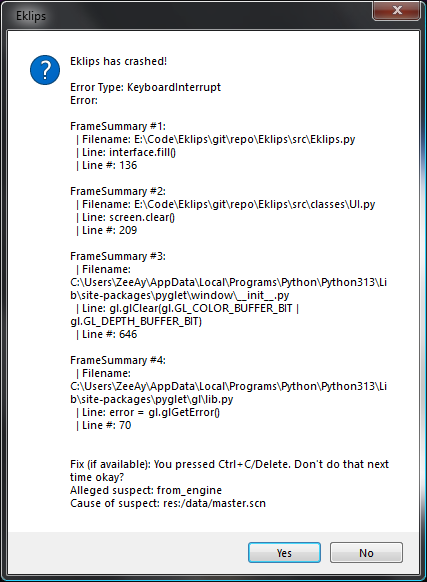

#  User manual for Sol
Welcome to Sol! This guide will help you get started with playing games created using the Sol Engine. Sol games offer a variety of experiences, and this manual will ensure you know how to install, run, and enjoy them.

## Table of Contents
 1. [Installation](#installation)
 2. [System Requirements](#system-requirements)
 3. [Errors](#errors)
 4. [FAQs](#faqs)

## Installation
Sol games will be bundled as a ZIP file, unextract it to where you want, and open the executable, Tampering with files is not recommended.

## System Requirements
You must have:
 - Microsoft Windows 7 or later 
 - The game you have to install

## Errors
When Sol crashses you will get this menu:  
  
The menu tells you the error the game has encountered, If you see this menu, attach a screenshot of the menu and go to the Issues tab of Sol and post it.

## FAQs

# Q: What should I do if I get a "File Not Found" error?
A: Most of the times, Sol will use fallback assets, but if you do get this issue, Try reinstalling the game or checking if the files are there.

# Q: Can I customize the controls?
A: Customization options vary by game. Usually, all controls are customizable if the dev provides a settings environment, If the dev doesn't provide one, You can [manually change these settings by following this guide.](guides/mcs.md).

# Q: How do I save my progress?
A: All games have an automatic save feature by exiting the game. Some games will have a pausing menu to save your progress when you want.
